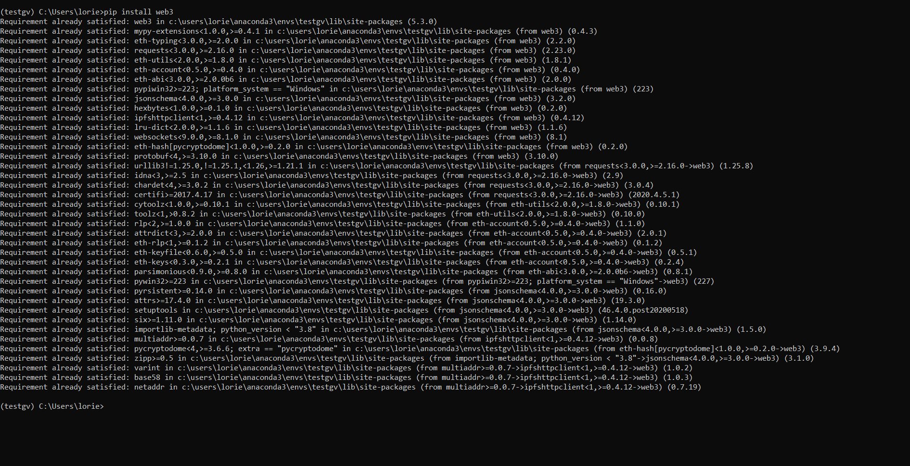
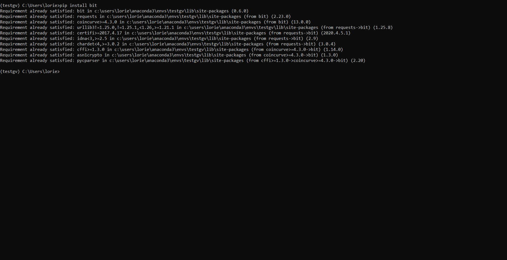
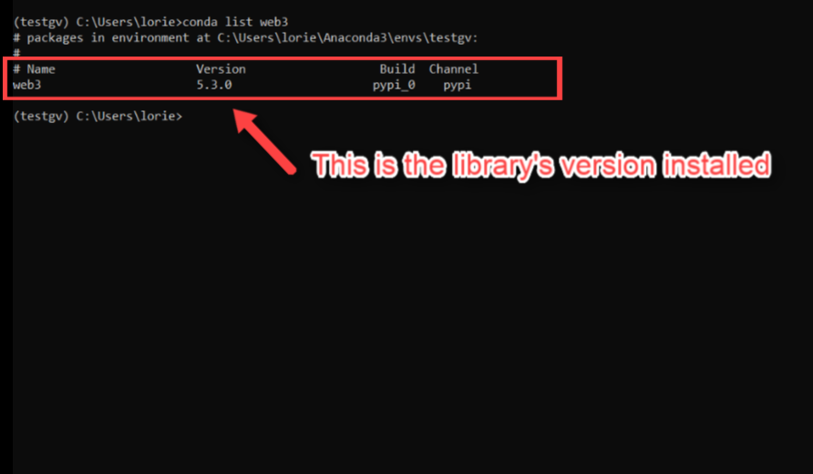
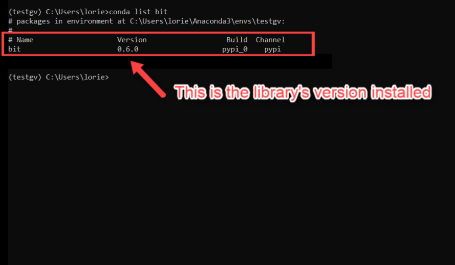
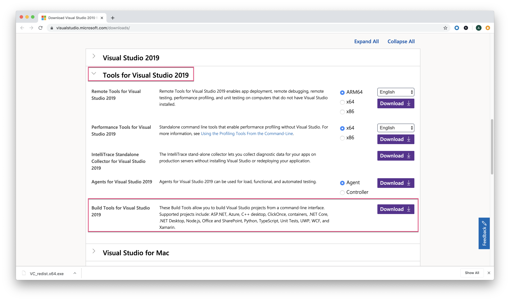

# Blockchain Transactions Install Guide

This guide serves as a step by step process for setting up and validating the [`web3.py`](https://web3py.readthedocs.io/en/stable/), [`bit`](https://ofek.dev/bit/), and [`hd-wallet-derive`](https://github.com/dan-da/hd-wallet-derive  ) libraries used to programmatically send and receive transactions over a blockchain network via virtual wallets. Without these libraries, class activities and their associated code will not be able to perform the necessary operations.

**Important Notes:**

* It is strongly recommended to create a new Python virtual environment for this unit to prevent cross-dependency issues.

* Windows users **MUST** use `git-bash` or _Anaconda Prompt_, and not the default Windows command prompt when you are requested to open the terminal window to execute commands, depending on the type of task to perform.

## Screencast Videos

If you need additional help in the installation process, you can follow the step by step video guides in the following links.

### Microsoft Windows Users

* [Installing Unit 19 Python Libraries for Windows](https://youtu.be/C6hXsiaaR8M)

### Mac OS X Users

* [Installing Unit 19 Python Libraries for MAC](https://youtu.be/ZQc86Yc18ME)

## Installation Process

Open a terminal and execute the following commands to install `web3.py` and `bit`, respectively. Windows users **MUST** use the _Anaconda Prompt_ in this section.

* Open the terminal and run the following command to create a brand new Python virtual environment for this unit.

  ```shell
  conda create -n ethereum python=3.7 anaconda
  ```

* Activate the new environment.

  ```shell
  conda activate ethereum
  ```

* Use the `pip install` command to download and install the `web3.py` module.

  ```shell
  pip install web3
  ```

  

* Use the `pip install` command to download and install the `bit` module.

  ```shell
  pip install bit
  ```

  

## Verify Installation

Once the `web3.py` and `bit` modules are downloaded and installed, verify that both installations completed successfully. Windows users **MUST** use `git-bash` in this section.

* Use the `conda list package_name` command, substituting `package_name` with `web3` to verify if the `web3` library installed successfully.

  ```shell
  conda list web3
  ```

  

* Use the `conda list package_name` command, substituting `package_name` with `bit` to verify if the `bit` library installed successfully.

  ```shell
  conda list bit
  ```

  

## Troubleshooting

It can be frustrating when packages do not install correctly, therefore use the below approaches to troubleshoot any installation or usage issues.

### Install Microsoft Visual C++ Build Tools In Windows

In some cases, the `Web3.py` library may fail to install in Microsoft Windows due to the need for Microsoft Visual C++ Build Tools. In such an event, following the below steps to resolve the issue:

1. Go to: https://visualstudio.microsoft.com/downloads/

2. Scroll down the page and click on "Tools for Visual Studio 2019" to reveal the sub-options.

3. Download the "Build Tools for Visual Studio 2019" package.

    

4. Run the package file and select the C++ build tools option. Then click install.

5. This process takes about 15 minutes

### Issues Installing `bit` or `web3` After Installing the Microsoft Visual C++ Build Tools In Windows

Along the installation process of `bit` or `web3` you may experience an issue related with the Microsoft Visual C++ Build tools in Windows if you update Windows after installing the build tools, and before installing these Python libraries.

You may see an error message that states that `wheel is not supported`, the solution for this issue is to uninstall and reinstall the Microsoft Visual C++ Build Tools.

### Update Conda Environment

An out-of-date Anaconda environment can create issues when trying to install new packages. Follow the below steps to update your conda environment.

**Important Note:** Windows users **MUST** use the _Anaconda Prompt_ to run these commands.

1. Deactivate your current conda environment. This is required in order to update the global conda environment. Be sure to quit any running applications, such as Jupyter, prior to deactivating the environment.

    ```shell
    conda deactivate
    ```

2. Update conda.

    ```shell
    conda update conda
    ```

3. Create a fresh conda environment to use with `web3` and `bit`.

    ```shell
    conda create -n ethereum python=3.7 anaconda
    ```

4. Activate the new environment.

    ```shell
    conda activate ethereum
    ```

5. Install the `web3` and `bit` packages.

    ```shell
    pip install web3
    ```

    ```shell
    pip install bit
    ```

---

© 2019 Trilogy Education Services, a 2U, Inc. brand. All Rights Reserved.
