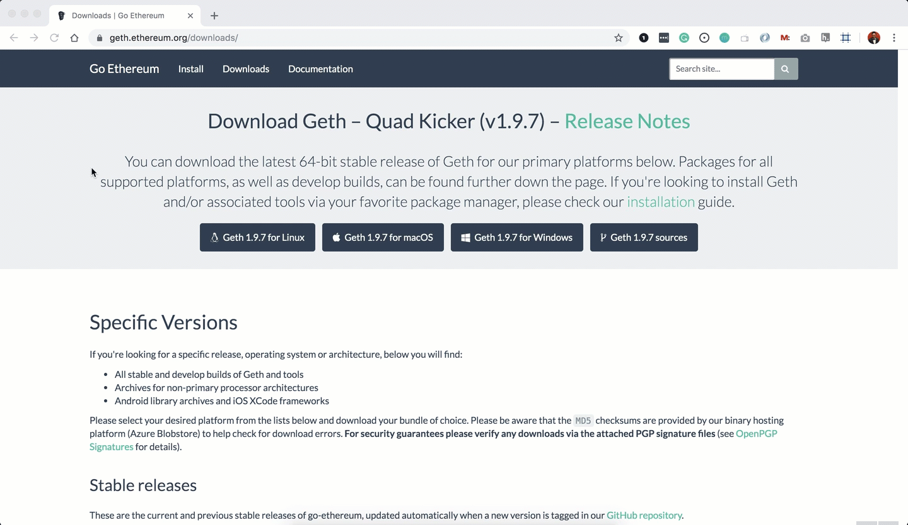
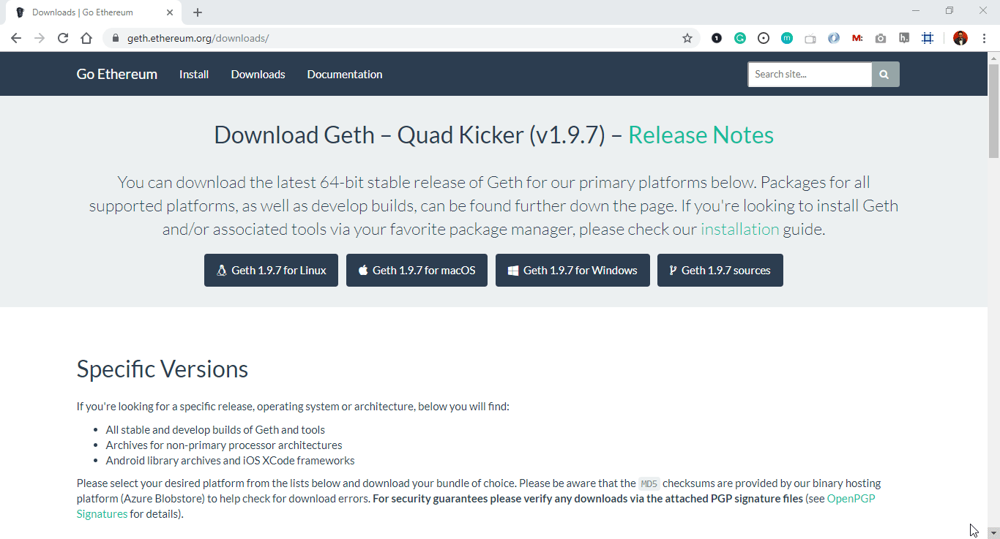
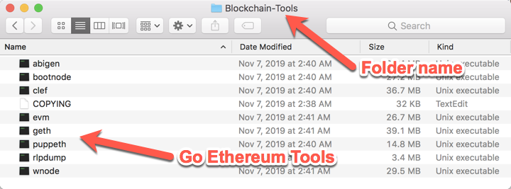

## Installing Go Ethereum Tools

[Go Ethereum](https://geth.ethereum.org/) is one of the three original implementations of the Ethereum protocol. It is written in Go, fully open-source and licensed under the GNU LGPL v3.

In this Unit, we will use Go Ethereum Tools to create our very own blockchain, from the genesis block to mining tokens and making transactions.

Despite there are installers for OS X and Windows, we will use the application executable binary files to have a seamless experience between both operating systems and avoid some technical issues that currently exist in Windows.

To install the Go Ethereum Tools, please follow the next steps:

1. Open your browser and navigate to the Go Ethereum Tools download page at https://geth.ethereum.org/downloads/

2. Scroll down to the "Stable Releases" section and proceed depending on your operating system.

 2.1. Installing in OS X.
 Click on the **"Geth & Tools 1.9.7"** to download the applications bundle archive.
 

 2.2. Installing in Windows.
 
 You need to know if you are running a `32 bit` or `64 bit` version of Microsoft Windows, if you are not sure about that, you can check your version following [these steps](https://support.microsoft.com/en-us/help/13443/windows-which-version-am-i-running).

 Depending on your Windows version, you should download the `32 bit` or `64 bit` version of the Go Ethereum Tools.

3. After downloading the tools archive, open your "Downloads" folder, and you will find a file named `geth-alltools-darwin-amd64-1.9.7-a718daa6.tar.gz` in OS X, and a file called `geth-alltools-windows-amd64-1.9.7-a718daa6.zip` in Windows. Note that the last numbers in the filename could vary depending on the last built available.

4. Decompress the archive in the location of your preference in your computer's hard drive, and rename the containing folder as `Blockchain-Tools`. We recommend using a location that can be easily accessed from the terminal window like the user's home directory.

 

5. You have finished the installation process; you will use these tools to create your very own blockchain!

---
© 2019 Trilogy Education Services, a 2U, Inc. brand. All Rights Reserved.
